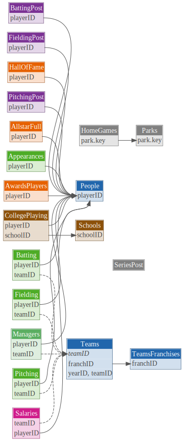

# lahmanTools

[](https://github.com/luceydav/lahmanTools/actions/workflows/R-CMD-check.yml)
[](LICENSE)
[](https://creativecommons.org/licenses/by-sa/3.0/)

`lahmanTools` downloads all 27 [Lahman](http://www.seanlahman.com/) baseball tables (1871–2025) directly from the [Chadwick Bureau baseballdatabank](https://github.com/cbwinslow/baseballdatabank) into a persistent **DuckDB** instance, and supplements it with salary data through 2025 (via Spotrac and USA Today) and FanGraphs WAR back to 1985. Pre-built SQL views handle the common sabermetric patterns — OPS, FIP, salary-per-WAR, team payroll, acquisition type, playoff efficiency, positional pay, and more. Connect the database to **GitHub Copilot CLI** or **Claude** via the included MCP server config and query 150 years of baseball in plain English.

Analysis in R runs via `data.table` and plain SQL — no tidyverse dependency, no loading 30+ tables into memory. DuckDB executes columnar SQL directly on the file, so aggregations across the full history run in milliseconds.

## Requirements

- R ≥ 4.1.0
- [`duckdb`](https://cran.r-project.org/package=duckdb) R package
- [`data.table`](https://cran.r-project.org/package=data.table) R package
- Internet connection (tables are downloaded from GitHub during setup)

## Installation

```r
# install.packages("pak")
pak::pak("luceydav/lahmanTools")
```

## Setup

The database lives outside the package at `~/Documents/Data/baseball/baseball.duckdb` by default. Override by setting `LAHMANS_DBDIR` (e.g. in `~/.Renviron`):

```sh
LAHMANS_DBDIR=/path/to/your/baseball.duckdb
```

Build the database once — all 27 Lahman tables plus derived views are written to disk:

```r
library(lahmanTools)
setup_baseball_db()
```

To extend salary coverage to 2017–2025 via USA Today data, scrape it first — **do not redistribute the output files** (see [data-raw/README.md](data-raw/README.md)):

```r
scrape_salaries(years = 2017:2025,
                output_dir = "~/Documents/Data/baseball/mlb_salaries")

setup_baseball_db(
  sal_file = "~/Documents/Data/baseball/mlb_salaries/salaries_2017_2025_with_playerID.csv",
  overwrite = TRUE
)
```

To add WAR-based salary efficiency analysis, pass `load_war = TRUE`. This requires
[`baseballr`](https://cran.r-project.org/package=baseballr) and an internet connection.
The Chadwick Bureau crosswalk (ODC-BY 1.0) and FanGraphs WAR leaderboards are fetched
at runtime to your local database — no data is bundled with the package:

```r
# install.packages("baseballr")
setup_baseball_db(load_war = TRUE, overwrite = TRUE)
```

This adds three supplemental tables and three derived views:

| Added | Type | Description |
|-------|------|-------------|
| `ChadwickIDs` | Table | Chadwick Bureau player ID crosswalk (ODC-BY 1.0) |
| `FangraphsBattingWAR` | Table | FanGraphs batter WAR leaderboard (1871–present) |
| `FangraphsPitchingWAR` | Table | FanGraphs pitcher WAR leaderboard (1985–present) |
| `PlayerIDs` | View | Lahman `playerID` joined to MLBAM, FanGraphs, Retrosheet, and BBREF IDs |
| `PlayerWAR` | View | `bat_war` + `pit_war` + `total_war` per player-season |
| `SalaryPerWAR` | View | `dollars_per_war` by player-season with `era` label |

> FanGraphs WAR now covers batting and pitching back to 1985, so `war_reliable`
> is TRUE for all rows in the salary era. The flag is retained for backward
> compatibility.

Loaders can also be run independently on an existing open connection:

```r
con <- connect_baseball_db(read_only = FALSE)
load_chadwick_ids(con)           # Chadwick crosswalk only (ODC-BY 1.0)
load_fangraphs_war(con)          # WAR + SalaryPerWAR (requires Chadwick first)
load_statcast(con, years = 2023) # Statcast pitch data (2015+; ~700 MB/season)
DBI::dbDisconnect(con, shutdown = TRUE)
```

## Data model

All 27 Lahman tables are downloaded from the [Chadwick Bureau baseballdatabank](https://github.com/cbwinslow/baseballdatabank) into DuckDB. The diagram shows the 20 primary tables, colour-coded by functional group, with arrows for primary-key → foreign-key relationships.



| Colour | Group | Tables |
|--------|-------|--------|
| 🔵 Blue | Identity spine | `People`, `Teams`, `TeamsFranchises` |
| 🟢 Green | Regular-season | `Batting`, `Pitching`, `Fielding`, `Appearances` |
| 🟣 Purple | Postseason | `BattingPost`, `PitchingPost`, `FieldingPost` |
| 🩷 Pink | Salary | `Salaries` |
| 🟠 Orange | Honours | `AwardsPlayers`, `AllstarFull`, `HallOfFame` |
| 🩵 Teal | Management | `Managers` |
| 🤎 Brown | College | `CollegePlaying`, `Schools` |
| ⚫ Grey | Lookups | `Parks`, `HomeGames`, `SeriesPost` |

To regenerate after schema changes: `Rscript analysis/schema_dm.R` (requires `dm`, `DiagrammeR`, `DiagrammeRsvg`).

### Derived views and macros

Sixteen views and one scalar macro are created by `setup_baseball_db()` and `create_stats_views()`.
Query them directly via SQL — no R wrangling required for the common patterns.

**Per-player stats views** (one row per player-year-stint-team):

| View | Base tables | Key metrics |
|------|-------------|-------------|
| `BattingStats` | `Batting` | PA, AVG, OBP, SLG, OPS, ISO, BABIP, BB%, K% |
| `PitchingStats` | `Pitching`, `Teams` | IP, ERA, WHIP, K/9, BB/9, HR/9, FIP, K/BB |
| `FieldingStats` | `Fielding` | FPCT, RF/9, RF/G by position |
| `SalariesAll` | `Salaries`, `SalariesSpotrac`, `SalariesUSAToday` | Chadwick Bureau (1985-2016) + Spotrac (2017-2021) + USA Today (2022-2025); filter `is_actual = TRUE` for confirmed figures |

**WAR and salary efficiency views** (require `load_war = TRUE`; see [Setup](#setup)):

| View | Description |
|------|-------------|
| `PlayerIDs` | Lahman `playerID` joined to MLBAM, FanGraphs, Retrosheet, and BBREF IDs via Chadwick crosswalk |
| `PlayerWAR` | `bWAR` + `pWAR` + `total_war` per player-season (1985+) |
| `SalaryPerWAR` | `dollars_per_war` by player-season with `era` label |

**Analytical views** (pre-built patterns for multi-era analysis):

| View | Description |
|------|-------------|
| `PlayerAcquisitionType` | One row per player-team; `acq_type` is `homegrown`, `young_acq` (arrived pre-26), or `veteran_acq` |
| `LeagueMedianSalary` | League-wide `med_sal`, `avg_sal`, `n_players` by season — use for `salary / med_sal` normalisation |
| `TeamPayroll` | `total_salary`, `n_players`, `median_salary`, `max_salary` by team-season |
| `PlayoffPayroll` | Team payroll by playoff round reached; `rounds_won`, `won_ws` flag — does spending buy championships? |
| `AllStarConcentration` | All-Star selections per team-season with payroll; `allstar_rate` for star-vs-depth analysis |
| `AwardSalaryPremium` | Salary and WAR before/after MVP, Cy Young, Gold Glove, and ROY — quantifies award-driven contract premiums (requires `load_war = TRUE`) |
| `HOFCareerArc` | Inducted HOF players with season WAR and salary; `years_before_induction` aligns careers for peak-vs-pay analysis (requires `load_war = TRUE`) |
| `PositionalPayroll` | Salary, WAR, and salary/WAR by primary position and era — reveals which positions are over- or under-paid (requires `load_war = TRUE`) |
| `ManagerPerformance` | Manager W-L%, division finish rank, and team payroll per season |

**Scalar macro** (callable in any SQL query):

| Macro | Usage | Returns |
|-------|-------|---------|
| `era_label(yr)` | `SELECT era_label(yearID) AS era …` | `'Pre-Moneyball'` / `'Moneyball'` / `'Big Data'` / `NULL` |

## Usage

```r
library(lahmanTools)

con <- connect_baseball_db()          # read-only by default
on.exit(DBI::dbDisconnect(con, shutdown = TRUE))

DBI::dbListTables(con)                # 27+ Lahman tables + 10 views (with load_war)
```

### Example: does an elite strikeout rotation pay off?

Top-10 team rotations by ERA, 2010–2016. High K/9 and low ERA are achievable
at very different price points — raw ERA does not predict a World Series ring.

```r
db_query(con, "
  SELECT t.yearID, t.teamID, t.W, t.WSWin,
    ROUND(CAST(SUM(p.SO) AS DOUBLE) / (SUM(p.IPouts)/3.0) * 9, 2) AS K9,
    ROUND(CAST(SUM(p.ER) AS DOUBLE) / (SUM(p.IPouts)/3.0) * 9, 2) AS ERA,
    ROUND(SUM(s.salary) / 1e6, 1)                                  AS payroll_M
  FROM Teams t
  JOIN Pitching p  ON t.yearID = p.yearID AND t.teamID = p.teamID
  JOIN Salaries s  ON s.playerID = p.playerID
                   AND s.yearID  = p.yearID
                   AND s.teamID  = p.teamID
  WHERE t.yearID BETWEEN 2010 AND 2016 AND p.GS >= 10
  GROUP BY t.yearID, t.teamID, t.W, t.WSWin
  HAVING SUM(p.IPouts) / 3.0 >= 400
  ORDER BY ERA
  LIMIT 10
")
#    yearID teamID   W WSWin   K9  ERA payroll_M
# 1:   2015    LAN  92     N 8.74 2.41      67.6   # best ERA, no ring
# 2:   2011    PHI 102     N 7.73 2.77      59.0
# 3:   2013    LAN  92     N 7.72 2.79      43.0
# 4:   2014    WAS  96     N 7.90 2.92      27.7   # great value
# 5:   2015    SLN 100     N 7.90 2.94      17.8   # $17.8M rotation!
# 6:   2016    CHN 103     Y 8.39 2.94      61.2   # WS winner
```

### Other useful patterns

```r
# Season-level batting with advanced stats
db_query(con, "SELECT * FROM BattingStats WHERE yearID = 2016 ORDER BY OPS DESC LIMIT 10")

# Team payroll vs wins
db_query(con, "SELECT * FROM TeamPayroll WHERE yearID >= 2000 ORDER BY yearID, total_payroll DESC")

# Career K/BB for starters with ≥ 1000 IP
db_query(con, "
  SELECT playerID,
    ROUND(SUM(SO) * 9.0 / (SUM(IPouts)/3.0), 2)                  AS K9,
    ROUND(CAST(SUM(SO) AS DOUBLE) / NULLIF(SUM(BB), 0), 2)       AS KBB,
    ROUND(SUM(IPouts) / 3.0)                                       AS career_IP
  FROM Pitching
  WHERE GS >= 10
  GROUP BY playerID
  HAVING career_IP >= 1000
  ORDER BY KBB DESC
  LIMIT 10
")
```

## AI-assisted querying (MCP)

If you use [GitHub Copilot CLI](https://docs.github.com/en/copilot/using-github-copilot/using-github-copilot-in-the-command-line) or [Claude Code](https://docs.anthropic.com/en/docs/claude-code/overview), you can connect either tool to `baseball.duckdb` via a local [DuckDB MCP server](https://github.com/alexmacy/duckdb-mcp-server). The AI agent writes and executes SQL against your live database in response to plain-English questions — no R session required.

### Setup

```bash
uv tool install duckdb-mcp-server   # or: pip install duckdb-mcp-server
```

Then let the package generate the config for you -- it resolves paths to
absolute form (required by Python-based MCP servers) and handles merging
with any existing config:

```r
# Preview the JSON that would be written
write_mcp_config()

# Write to ~/.copilot/mcp-config.json when satisfied
write_mcp_config(dry_run = FALSE)
```

Or write it manually -- replace the paths with your actual binary location
(`which duckdb-mcp-server`) and database path:

```json
{
  "mcpServers": {
    "baseball": {
      "command": "/Users/you/.local/bin/duckdb-mcp-server",
      "args": ["--db-path", "/path/to/baseball.duckdb", "--readonly"]
    }
  }
}
```

`--readonly` is required -- omitting it allows an AI agent to mutate or drop tables.

### What an interaction looks like

Once configured, you ask questions in the chat interface and the agent translates them to SQL automatically:

```
User: Which era had the best payroll efficiency — wins per dollar spent?

Agent: Querying SalariesAll JOIN Teams, grouping by era...

  era            avg_wins_per_1M_USD
  Pre-Moneyball  8.3
  Moneyball      11.2
  Big Data        5.7

The Moneyball era (2003-2011) had the best efficiency. 2012 was the
single most efficient season at 23.5 wins/$1M. Efficiency has declined
steadily as salary inflation has outpaced on-field wins.
```

The full schema is available — player careers, team trends, era comparisons,
salary analysis across the three-source `SalariesAll` view. Multi-table joins
and window functions work as expected.

See [CONTRIBUTING.md](CONTRIBUTING.md) for full setup instructions including
config file locations for different AI tools.

## Package structure

```
R/
  connect.R      # connect_baseball_db()  — open DuckDB connection
  setup_db.R     # setup_baseball_db()    — build / rebuild the database
  stats_views.R  # create_stats_views()   — register sabermetric SQL views
  loaders.R      # load_chadwick_ids(), load_fangraphs_war(), load_statcast()
  scrape.R       # scrape_salaries()      — fetch USA Today salary data
  mcp_config.R   # write_mcp_config()     — generate MCP server config for AI tools
  utils.R        # db_query(), dt_factors_to_char(), clean_names()
  globals.R      # globalVariables() declarations
```

## Salary scrapers

`data-raw/` contains scripts for collecting MLB salary data from third-party
sources. **Review each site's Terms of Service before running them.**
See [`data-raw/README.md`](data-raw/README.md) for legal notes and
alternative data sources. Scraped output is excluded from version control
and must not be redistributed.

## Attribution

`lahmanTools` is a tooling package — it does not bundle third-party data.
All data is fetched at runtime from the sources below. When you publish
analysis that uses these datasets, your attribution obligations depend on
the source license.

| Source | License | Obligation |
|--------|---------|------------|
| [Sean Lahman Baseball Database](http://www.seanlahman.com/) via [cbwinslow/baseballdatabank](https://github.com/cbwinslow/baseballdatabank) | [CC BY-SA 4.0](https://creativecommons.org/licenses/by-sa/4.0/) | Credit Sean Lahman and carry the same license in any derivative work. |
| [Chadwick Baseball Bureau Register](https://github.com/chadwickbureau/register) | [ODC-BY 1.0](https://opendatacommons.org/licenses/by/1.0/) | Credit the Chadwick Baseball Bureau when publishing work that uses the player ID crosswalk. |
| [FanGraphs WAR Leaderboards](https://www.fangraphs.com) | Copyright FanGraphs | Do not redistribute the fetched data. |
| [Baseball Savant / Statcast](https://baseballsavant.mlb.com/) | Copyright MLB Advanced Media | Do not redistribute the fetched data. |
| USA Today / Spotrac salary data | Proprietary — ToS applies | See [`data-raw/README.md`](data-raw/README.md). Do not redistribute. |

FanGraphs, Chadwick, and Statcast data are fetched via the
[`baseballr`](https://billpetti.github.io/baseballr/) package
(MIT, Bill Petti and contributors).

## License

MIT © David Lucey
